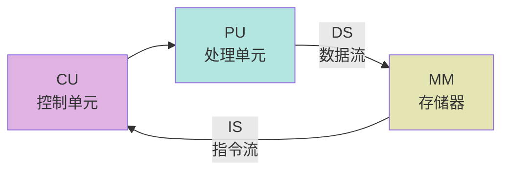
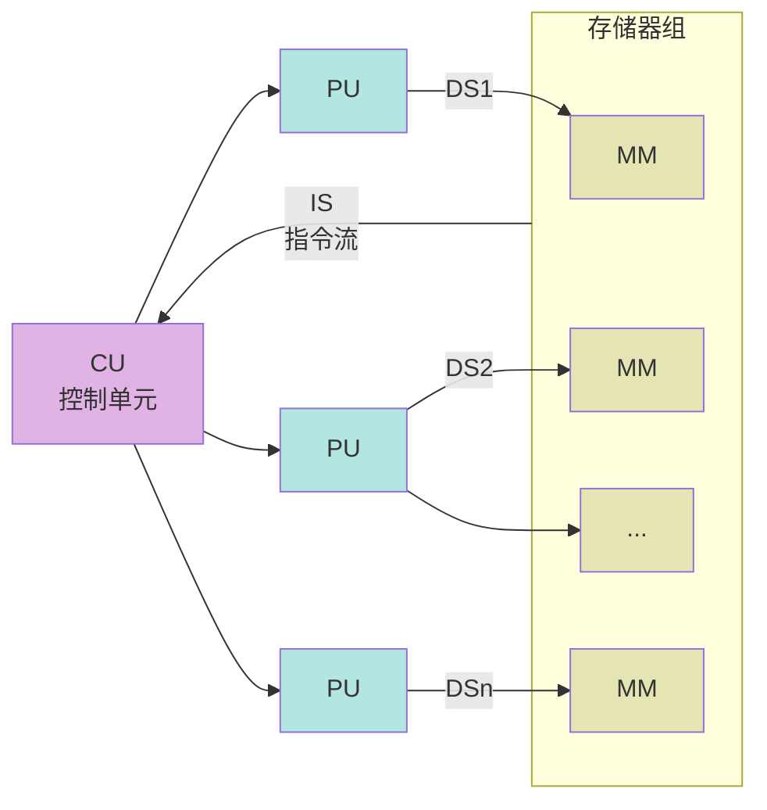
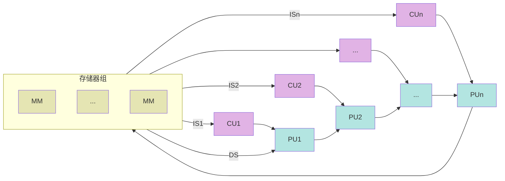
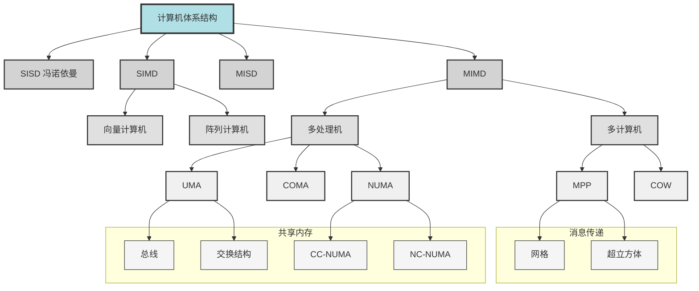

## Flynn 分类法
SISD：Single Instruction Single data 串行计算机
SIMD：Single Instruction Multiple Data 适用性有限，GPU 思想
MISD：Multiple Instruction Single Data 没卵用，现实中也没有
MIMD：Multiple Instruction Multiple Data 常见的并行计算机都可归入此类

### SISD

### SIMD

MISD

## 共享内存系统——
## 共享内存系统——NUMA
- Non-Uniform Memory Access 非均匀存储器访问
	- 共享存储器分布在所有的处理器中
	- 处理器访问存储器的**时间不均匀**
	- 每台处理器可带**私有**高速缓存
	- **外设**可以一定形式**共享**
## 共享内存系统——CC-NUMA

- CC-NUMA Coherent-Cache Nonuniform Memory Access 告诉缓存一致性非均匀存储访问
	- 大多数使用基于目录的高速缓存一致性协议
	- 保留 SMP 易于编程的优点，改善常规 SMP 的可扩放性
	- 分布共享存储的 