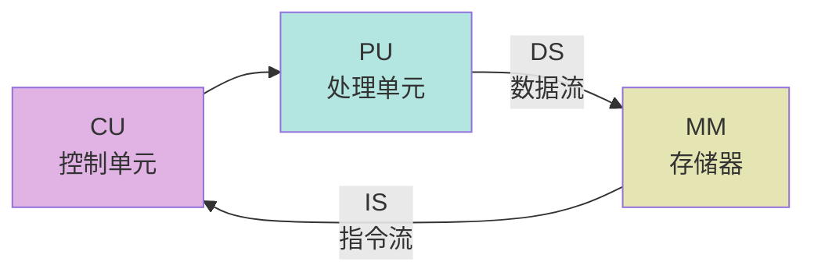
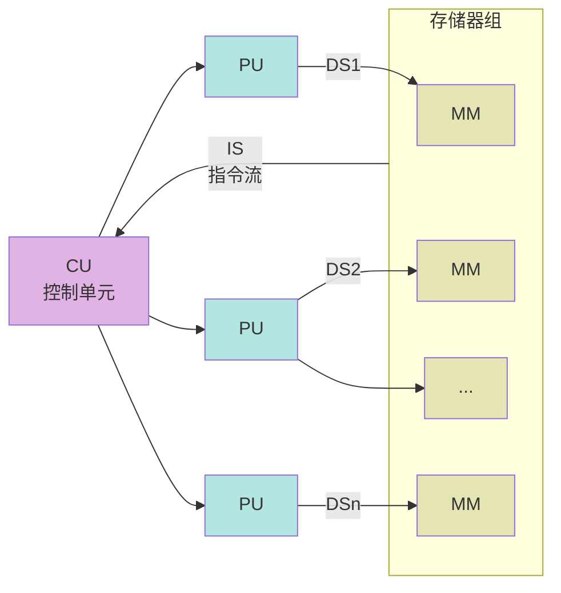
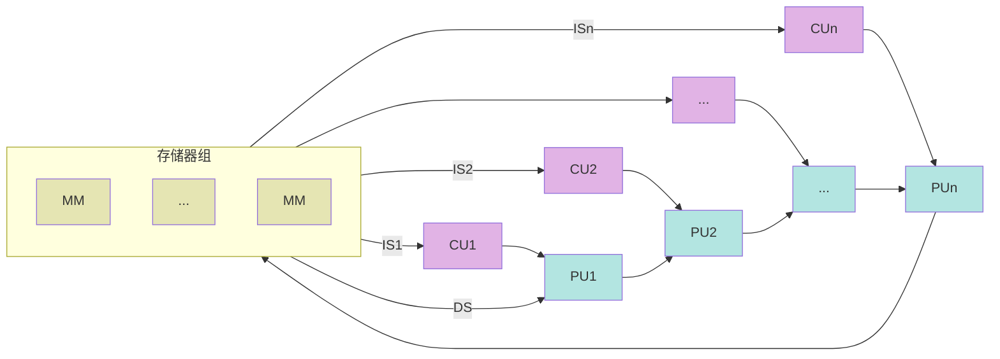
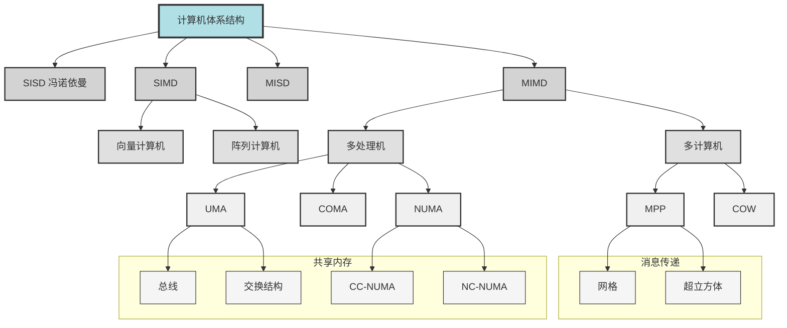

## 并行系统分类
### Flynn 分类法
SISD：Single Instruction Single data 串行计算机
SIMD：Single Instruction Multiple Data 适用性有限，GPU 思想
MISD：Multiple Instruction Single Data 没卵用，现实中也没有
MIMD：Multiple Instruction Multiple Data 常见的并行计算机都可归入此类

#### SISD

#### SIMD

#### MISD

## 共享内存系统
### UMA
### NUMA
- Non-Uniform Memory Access 非均匀存储器访问
	- 共享存储器分布在所有的处理器中
	- 处理器访问存储器的**时间不均匀**
	- 每台处理器可带**私有**高速缓存
	- **外设**可以一定形式**共享**
### CC-NUMA
- Coherent-Cache Nonuniform Memory Access 告诉缓存一致性非均匀存储访问
	- 大多数使用基于目录的高速缓存一致性协议
	- 保留 SMP 易于编程的优点，改善常规 SMP 的可扩放性
	- 分布共享存储的 DSM 多处理机系统
	- 程序员无需明确地在节点上分配数据
- UMA 和 NUMA 的一个折中方案
### COMA
- Cache-Only Memory Access 全高速缓存存取
	- 没有存储层次结构，全部高速缓存组成全局地址空间
	- 利用分布的高速缓存目录进行远程高速缓存的访问
	- COMA 中的高速缓存容量一般**大于2级**高速缓存容量
	- 数据开始时可以**任意分配**
- 激进的方案，把 Cache 的概念发挥到极致

## 分布式内存系统
- 通用多计算机体系结构
	- 每个节点都由一个或者多个 CPU、RAM、磁盘以及其他的输入/输出设备和通信处理器组成
	- 通信处理器通过**互连网络**相互连接起来，可以使用多种不同的**拓扑结构**，交换策略和寻径算法
### MPP
- Massively Parallel Processor  大规模并行处理机
	- 由成百上千台处理机组成的大规模并行计算机系统
	- 过去主要用于科学计算、工程模拟等以计算为主的场合，目前也广泛应用于商业和网络应用中
	- 开发困难，价格高，市场有限，是国家综合实力的象征
- 系统特点
	- 一般使用标准的商用 CPU 作为它们的处理器
	- 使用了高性能的私用的互连网络，可以在低延时和高带宽的条件下传递消息
	- 具有强大的输入输出能力
	- 能够进行卓越的容错处理
- LM: Local Memory 本地存储
- NIC: Network Interface Card(?) 网络接口电路
- MB: Memory Bus 存储器总线
### Cluster
- Cluster 集群（COW机群）
	- 由大量的PC机或者工作站通过商用网络连接在一起构成
	- 可以完全使用可以买到的商用组件搭配而成，这些商用组件都是大规模生产的产品，能够获得较高的性价比

- 与MPP的区别（体系结构方面）
	- 节点是完整的计算机，计算机可以是同构或异构
	- 节点都有自己的内存，甚至有自己的完整的操作系统；而MPP系统结点一般没有磁盘，只由单操作系统内核
	- MPP使用制造厂商专有的高速通信网络；COW一般采用公开销售的产品，是局域网或专线网，网络通常是与节点计算机的I/O总线相连（松散耦合），而MPP的网络接口是连到处理节点的存储总线上（紧耦合）

## 异构系统架构
- **多种**处理器或核心
- 使用**加速器**来提高性能或能源效率，通常结合专门的处理能力来处理特定任务
- 适合执行 SIMD 和 SIMT(T:threads)

——CPU——GPU——FPGA——AISC——
越左边越灵活（通用型）
越右边越高效（专用型）
### NVIDIA GPU
不关心控制、Cache，面积几乎都给了计算核心